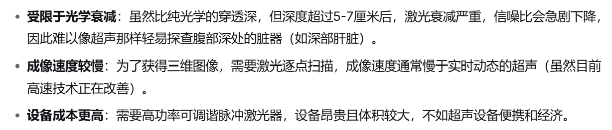
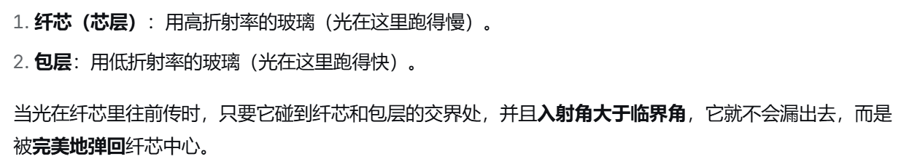
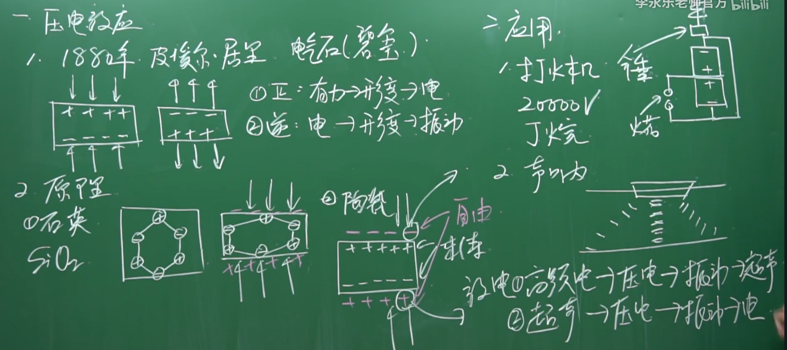
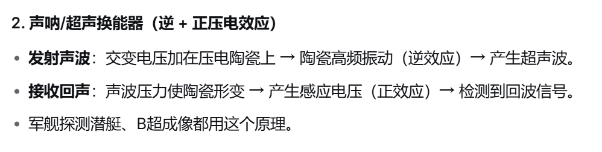
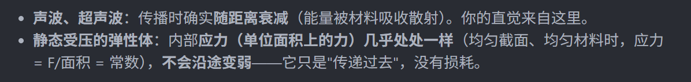

# Photoacoustic Triaxial Force Sensing 精读笔记

> **论文**：Photoacoustic Triaxial Force Sensing via Integrated Polymer Waveguides for Ultra-Compact Robotic Surgical Instruments
> **作者**：Danqian Cao, Guanglin Cao, Jian Hu, Tianrui Zhao, Shuai Wang, Wenfeng Xia, Hongbin Liu
> **期刊**：IEEE/ASME Transactions on Mechatronics
> **DOI**：10.1109/TMECH.2025.3628300
> **阅读对象**：大一新生（具备基础微积分与线性代数）
> **数学深度**：只讲原理（每个公式说明"表达什么关系"，不推导）

---

## 一、一句话看懂这篇论文

> 用「**光 → 声**」的转换（光声效应），做一个只有 **3 毫米直径、8 毫米长**的微型传感器，装到微创手术器械的**尖端**，去测它受到的**三个方向**的力（往下压的法向力 + 左右前后滑的剪切力），并且只用**一根光纤**传光进去、用**一个声波接收器**收声出来。它用一个光源 + 一个接收器就把三个力分量"解耦"拆开了。

这是该领域的**首创**：第一次把"光声效应"用在"力的测量"上。

---

## 二、背景与动机：为什么做这个

### 1. RMIS —— 机器人辅助微创手术（robotic-assisted minimally invasive surgery）
- **微创手术**：不开大刀口，钻几个小孔（或自然孔道）伸进细器械操作，创伤小、恢复快、感染风险低。
- **机器人辅助**：医生操控机器人，机械臂拿着细长器械（导管、针、活检钳等）。
- **核心痛点**：器械又细又长又软，医生在**近端**（握手里）感觉不到**远端**（尖端碰到的组织）用了多大力。就像用一根很长很软的筷子夹菜，手感觉不到筷子尖夹得多紧。

### 2. 触觉反馈（Haptic feedback）—— 为什么要测力
- 没力反馈，医生只能"盲操作"，易用力过大**戳伤组织、穿孔**。
- 有力反馈，医生能：感受组织软硬（摸肿瘤），缝合时控制夹持力，打结时监力，实时检测打滑。

### 3. 三轴力（Triaxial force）—— 力的三个分量
想象手指按在桌面上：
- **法向力（Normal，N）**：垂直压下去的分量（沿 z 轴）。
- **剪切力（Shear，Sx, Sy）**：贴着表面滑动的分量（沿 x、y 轴）。

这三个分量合起来才完整描述器械尖端和组织的接触；只测一个方向（单轴）不够。

### 4. 解耦（Decoupling）—— 核心难点
传感器被压的同时也被搓，输出信号里**混着**三个力的影响。**解耦 = 从混在一起的信号里，把 N、Sx、Sy 干净地拆出来。**
- 现有传感器的痛点：要么体积大塞不进 3mm，要么测不准、拆不干净。

### 5. 现有方法的局限（引言）
- **本征式（intrinsic）**：不在尖端装传感器，靠数学模型（电机力/图像）间接推算。缺点：离接触点远，要补偿摩擦、惯性等，不准。
- **外置式（extrinsic）**：尖端附近直接装。有压阻、电容、光学、磁等，各有毛病（体积大、怕电磁干扰、测不全三轴）。
- **光纤方案**：细、抗电磁干扰、生物相容，但常只能测单轴；多光纤/光栅又贵又复杂；传统超声器件笨重只能测距离。

---

## 三、必须先理解的核心概念

### 概念 1：光声效应（Photoacoustic / PA effect）—— 整篇的地基
**"光 → 声"三步**：① **吸收**（吸光材料——这里用**蜡烛烟灰 CS**，碳纳米颗粒）吸收激光；② **光热转换**（光能变热，纳秒级脉冲使其瞬间升温）；③ **热弹性膨胀**（受热膨胀，急速膨胀挤出超声波 >20kHz）。
- **类比：闪电→雷声**。闪电加热空气（光热），空气急速膨胀发出"轰"雷声（声波）。这里只是用微小激光+材料，产生超声波。
（超声成像：超声波打进去遇到组织界面，反射回去。主要显示器官的形态结构（如大小、边界），但分不清组织的化学成分。光声成像则是用激光激发组织，不同物质（如血红蛋白、脂质、黑色素）吸收激光后产生的声波信号不同。因此，它能直接**看到血氧饱和度、血管分布、血红蛋白浓度**等生理功能信息，甚至能追踪特定的靶向分子探针，这是超声做不到的。光声成像结合了“光激发”和“声传播”，利用声波在组织中散射较少的特性，能够在**几厘米的深度**仍保持较高的空间分辨率（几十到几百微米），这是纯光学技术无法达到的深度。）



【**光声成像确实融合了光学对比度和超声分辨率的优势，但NFL定理说，没有一种万能算法/系统能在所有指标上同时最优。光声成像为了“光+声”的融合，也付出了相应的代价。**】

**⚠️ 最重要的一点：光声效应有两种完全不同的用法，别搞混**（初学几乎必卡，这里是本篇的地基）

|           | **光声成像**         | **这篇论文（力传感器）**      |
| --------- | ---------------- | ------------------- |
| 谁发声？      | **生物组织**受热膨胀     | **传感器自己的发射器（CS）**   |
| 传感器/探测器干嘛 | 只当**麦克风**，听组织的声音 | **既是喇叭（发）又是麦克风（听）** |
| 组织干嘛      | 被照亮、是成像对象        | **只是"压"传感器的手**，不发声  |

- **光声成像**：`激光 → 照进组织 → 组织受热膨胀自己"嘣"→ 探测器被动听 → 成像`。发声音的是**组织**，探测器**只负责听**。
- **这篇力传感器**：`激光（经光纤送进传感器自己体内）→ 自己的 CS 发射器吸收 → "嘣"一声 → 穿过 PDMS 传到 PVDF 接收器 → 测时间/幅度`。发声音的是**传感器自己**（CS），接收器听的是**自己那一响**。
- **组织在这里完全不发声**，它只是把 PDMS 压变形（压扁/推开），从而**改变了声音在 PDMS 里传的时间长短和幅度**——这就是"力"这个待测量的载体。

**为什么必须"自给自足"、不能靠组织发声？** 若让组织发声，声音强弱、时间**全由组织性质决定**（吸收多少光、含多少血、多紧实），无法控制，且变化无法干净对应"力"（组织一变信号就乱，测出来的是"组织什么样"而非"压了多重"）。而靠**自己内部的发射器**发声，声源**已知、可控、固定**，测到的信号**只反映一件事——这个软胶被挤/被推成什么样**，也就是只反映**力施加的变形**，才能干净解耦成力。

> 一句话锚定：**光声成像**＝组织是"自带音箱的演唱者"，传感器是台"录音笔"；**这篇力传感**＝传感器"自己敲钟自己听"，组织只是那只**按在铃铛上的手**。整条光→声→电的闭环都在传感器内部，组织只在外面当"施力的手"。

**补充：为什么蜡烛烟灰（CS）能做好光声发射器？**

> 一句话：CS **不是本文首创、也不是性能最强的**，它在光声成像领域是一套**很常用、成熟的"土办法"**；但用它来做**力传感**是新的。选它不是因为它光声效率最高，而是因为它**恰好满足了这个器件的一堆苛刻约束**（极小尺寸、能盖章成型、便宜、生物相容）。

| 光声需要什么 | CS 为什么有 |
| --- | --- |
| **强吸光** | 碳是**类黑体**，从紫外到近红外几乎**全波长强吸收**——正好吃下 808nm 激光 |
| **转换效率高** | 碳的**格吕内森参数 Γ**（受热→变声压的效率）和热膨胀系数组合理想，转化率高 |
| **响应快、宽带** | 烟灰是**疏松纳米多孔**结构，受热时局部微区瞬间爆发膨胀，产生高频宽带超声 |
| **声学能耦合出来** | 它的声阻抗靠近生物组织 / PDMS，超声不容易被"憋在里面" |
| **生物相容** | 碳本身低毒，比金属/半导体更适合体内 |

**最关键的一条**：它是**可图案化**的。论文 Step4 用 **CNC 钢印章把烟灰"盖印章"压进 PDMS**，做成 100–150µm 的层。这正好能实现**三块 120° 扇形**发射器。很多更"高级"的吸光材料（碳纳米管、金膜、PEDOT:PSS）要么贵、要么工艺复杂、要么难做成任意 3D 图案，而烟灰"烧一支蜡烛就有、还能盖章成你要的形状"。

> 📌 **归因**：上面表格中"碳是类黑体强吸光""Γ 效率高""纳米多孔结构""声阻抗匹配""可图案化/盖章成型（100–150µm、Step4 用 CNC 钢印章压印）"这些是**论文直接提供的**；"它在该领域里是经典成熟配方，选它是因性价比/可加工性最优而非性能最强""生物相容、低毒相对于金属"这些属于**我基于领域知识的推断与补充**，论文未这样论证。

### 概念 2：光纤与高斯光束（beam）
- **光纤**：细玻璃/塑料丝，光靠**全反射**传输，能进极窄空间。
（光在不同介质中的传播速度不一样，造成了全反射现象）
（当光进入玻璃、水或者塑料时，因为要和里面的无数原子“撞来撞去”，所以跑得**变慢了**。）

- **多模光纤**：能同时传多"模式"，芯粗（这里 200 µm 芯径）。
- **高斯光束**：出射光**中间最亮、越外越暗**（钟形曲线）。这是数学建模的起点（公式 2）。之所以剪切力能测，正因**光斑径向不均匀（中间亮、边缘暗，有径向梯度）**。
（它的名字来源于描述这种分布的数学函数——**高斯函数**（也就是统计学里的“正态分布”钟形曲线））

### 概念 3：弹性体 / PDMS
- **弹性体（elastomer）**：像硅胶能大幅变形并恢复。
- **PDMS**：透明硅胶，生物相容、透明、弹性好。传感器主体，力作用在它身上让它变形。

### 概念 4：胡克定律与两个模量
- **胡克定律**：弹簧力 ∝ 伸长量（F = k·Δx）。
- **杨氏模量（Young's modulus，E）**：被拉/压变形的刚度，E 越大越硬。E = 应力/应变 = (力/面积)/(长度变化/原长)。
- **剪切模量（shear modulus，G）**：被搓/滑动变形的刚度。
- 用 E、G 把"力"和"变形量"联系（公式 14、15）。

### 概念 5：压电效应
- **压电材料**（这里 PVDF 薄膜）：被声波压一下产生电压；声波强弱不同，电压大小不同。
- 于是 光 → 声 → 电信号 → 电脑能读的电压波形。
- 1880 年，皮埃尔·居里和哥哥雅克·居里在研究热电现象与晶体对称性时产生了一个推测：既然某些晶体受热会在表面出现电荷，那么施加机械应力会不会也行？他们用石英、电气石、罗谢尔盐等晶体做实验，果然测到了：**晶体受力形变时，特定晶面上会出现束缚电荷**。这就是正压电效应（piezoelectricity）。
- 关键前提：晶体结构必须**没有对称中心**。32 种晶体点群中有 21 种无对称中心，其中 20 种具有压电性（石英、罗谢尔盐、PVDF、PZT 陶瓷等都在此列）。有对称中心的晶体受压时电荷中心依然重合，永远“挤”不出电。



（踩地发电）

### 概念 6：传播时间与声速
- 声波从发射器到接收器需时间：**时间 = 距离 ÷ 声速**。
- 弹性体被压扁、距离变短 → 声波**更早**到 → 传播时间**变短**。这是"用力→变形→测时间"的原理。

### 概念 7：泰勒展开（常用微积分工具）
- 把复杂函数在某点附近用多项式近似。当变形量 Δz 很小时近似成**线性**（一次）或**二次**。
- 本文：法向力 → 功率变化近似**线性**；剪切力 → 近似**二次**。

### 概念 8：光能量密度 / 注量（Fluence，O）
- 单位体积/面积沉积的光能量。**"接收到的光能量" = 功率 × 时间**（＝走了多远＝速度×时间）。能量越多声音越强。

### 概念 9：格吕内森参数（Grüneisen parameter，Γ）
- 无量纲材料常数，衡量"受热后把热量变声压的效率"。Γ 越大 → 同样光能 → 越强声波。

---

## 四、逐节精读（图文结合）

### 摘要 + 引言
- **要解决的问题**：微创器械尖端三轴力测量，难同时"测得准"和"做得小"。
- **现有方法问题**：本征式不准；外置式体积大、怕电磁干扰、测不全三轴；光纤方案难测三轴。
- **本文切入点**：光纤好但难测三轴；声波带方向信息但传统超声笨重。**结合两者 → 光声效应。**
- **三大贡献**：① 单光纤+聚合物波导实现三轴；② 新力传感模型+解耦算法；③ 3mm 直径超小体积（Φ3×8mm，传感单元 Φ2×4mm）。

### 设计与传感原理（图 1、图 2）
- **结构**：脉冲激光 → 多模光纤 → 经陶瓷套管保护的传感器支架 → 弹性体远端。
- **三块发射器**：嵌入 PDMS 圆柱体，被切成三个 120° 扇形，且**轴向深度不同**（离接收器 2.5 / 3.0 / 3.5 mm）。
- **接收器**：近端**透明 PVDF 压电膜**（透明，光能穿过继续前进），铜电极接口，精密外壳（Φ3×7.8mm）。

- **图 2(b) 关键**：激光射向远端，三个 120° 扇区，绿色横截面坐标 x/y，红色是激光出射中心点，Sector III 保持 x 轴对称作为空间参考。
- **图 2(c) 法向力**：弹性体压缩（Proximal/Distal 靠近），发射器离接收器更近 → 传播时间变短；离激光源更近 → 吸光更多 → 声音更强。
- **图 2(d) 剪切力**：弹性体被侧移/倾斜（Distal 横向偏移），平均距离不变但光斑相对三扇区**重新分布**：靠剪切方向的扇区移向光束中心吸光最多、发声最强，对面减弱 → 幅度差编码剪切方向和大小。

**为什么切三块、放不同深度（全篇最妙设计）**：
1. **不同深度** → 三个声信号到达接收器时间不同 → 时间上能分开识别。
2. **切成三块** → 破坏圆形对称，让剪切力方向可分辨。
3. 三块是确定二维方向的最小扇形数，且提供冗余。

**核心原理**：**法向力**看"平均传播时间"；**剪切力**看"三个扇形声波幅度差异"。一个看时间、一个看幅度，两者分工 → 解耦。

**深度解读：为什么要这样设计（完整推理链，从"必须测三轴"逆推出来）**

> 📌 **归因**：下面"从测力需求一步步逆推出这个结构"的**因果叙述**属于我补充的解读，帮你理解设计动机；每一处**物理机制的结论**（三扇区、不同深度、光斑高斯分布、共模/差模、图 2 的变形方向）都依据论文图 2 与公式 (1)(2)。两者不混。

一枚这样的探针顶端，碰到物体后，它能在电信号上留给你的**只有两个信息**：时间和幅度。

传感器要测的是 **N、Sx、Sy 三个力分量**，但圆形对称的结构天生分不清方向。整个设计是围绕"打破它、再把它翻译成能测的量"一步步逆推出来的：

**第 1 步：为什么必须打破对称**
- 如果发射器是一个完整的、处处对称的圆盘，它在任何方向受力，对底下接收器来说效果几乎一样：往下压 → 变近变亮、声变早变强；往侧推 → 若光斑均匀，距离没变、吃光也没变。**方向信息全丢。** 就像纯白圆球看不出它往哪滚——要分方向，先做上标记，打破对称。

**第 2 步：为什么正好切成 3 个 120° 扇区**
- 120° × 3 = 360°，三个扇区**互不重叠、正好铺满整个圆**。每一个扇区 = 一个独立读数 = 一个"方程"。要解出 N、Sx、Sy 三个未知量，至少需要 3 个独立读数，**3 块正好**（2 块不够，4 块浪费）。这是数量上的必然。

**第 3 步：为什么埋在三个不同深度（时间标签，关键一招）**
- 三块饼被**同一束激光**同时照 → 同时"嘣"。如果它们还在同一高度，三个声波**同时**到达同一个接收器，叠加成一团，分不清哪块贡献了多少。
- 解法：把三块埋在**不同深度**（离接收器 2.5 / 3.0 / 3.5 mm）。声要跑到同一个耳朵，**路程不同 → 到达时间不同**。于是一声激光下去，听到的是**三个先后错开的"嘣"**：浅的先到、深的后到。
- 这个时间差是**固定造出来的、与受力无关**——它只负责把三块饼的读数"打上标号、能分开看"，不负责测力。本质是**时间多路复用（TDM）**：一个接收器，靠时间分隔三路信号。

**第 4 步：让"压"和"滑"各走一个通道（解耦的物理本质）**
- **法向力（往下压）**：软胶被压薄 → 三块饼**整体**离接收器更近 → 三个脉冲**全部提前**（时间变短）；同时整体更贴近激光源 → **全部变强**。→ 法向力主要看"**时间**怎么变"。
- **剪切力（往侧滑）**：探针整体**平移**，不压软胶，深度不变 → **离接收器的平均距离不变 → 时间基本不变**。但光斑在三个扇区之间**重新分布**：因为光斑"中间亮、边缘暗"，被推向光中心的扇区吃光最多 → 声最强，对面变暗 → 声最弱。→ 剪切力主要看"**三个扇区的幅度差异**"。
- 一个动时间、一个动幅度，**来源不同、互不干扰** → 这就是"解耦"最底层的物理原因，不是靠算法硬拆，是**两种力本身就作用在两个不打架的量上**。

**第 5 步：为什么"光斑中间亮"是剪切力能测的前提**
- 前面反复出现"光斑中心亮、边缘暗"，它不是装饰，而是剪切力测感的**咽喉**。若光束是均匀的（平顶），侧移时三个扇区吃光量几乎不变，就没有"哪个扇区更亮"的差异可读 → **剪切灵敏度归零**。
- 正因为光斑呈高斯分布（**径向梯度**），扇区移向中心才**多**吸光、移开才**少**吸光，才把"探针往哪滑"翻译成"哪块饼亮、哪块暗"的幅度差 → 方向和大小。注意这与第 2 步**互补**：光斑的亮度梯度是"原料"，切成多块是"能加工出方向的工具"，缺一不可。

**第 6 步：扇区 III 的 "x 轴对称" 有什么用（坐标基准）**
- 三个扇区朝向相差 120°、对称轴方向各不相同。论文特意让 **Sector III 的对称轴对齐 x 轴**（关于 x 轴对称），从而**定死一个固定的全局坐标系（x、y）**——这就是它说的 "establish spatial reference"（建立空间参考）。
- Sector I、II 的读数要借旋转矩阵（公式 16）**转回这个全局坐标系**，三路读数才能对齐、放到同一个坐标系里比较。

**第 7 步（真正的解耦）：三块合一联立方程，而不是拿哪块当参照**
- 你会自然地想："y 剪切时扇区 III 不纯/不动不了，怎么解耦？" —— 答案：**解耦从头到尾不靠"某个扇区当参照"，而是三个扇区合起来解一组方程。**
- 每个扇区给一个读数（公式 20）：`(ΔA/A0)_i = Ci1·α + Ci2·β·Sx + Ci3·γ·Sx² + Ci4·δ·Sy²`。
- **三个扇区 = 3 个方程**，而未知剪切量只有 **Sx、Sy 两个**（法向 N 由传播时间 Tc 单独解出，公式 13）→ 构成**超定方程组**（方程数 > 未知数）。
- **怎么解**：① 先**标定**——施加已知剪切力、测对应幅度变化，用**伪逆 / 最小二乘**（公式 19）反解出每个扇区的系数 Ci；② 测量时把三个读数一起列进去，用非线性最小二乘（`lsqnonlin`，公式 20）**同时解出最优 Sx、Sy**，冗余的第三个方程让结果更准。
- **为什么三个扇区一定解得出任意方向的剪切**：它们朝向相差 120°，对 Sx、Sy 的**灵敏度矢量线性无关**——三根不同方向的"测量天线"足以覆盖整个二维剪切平面。无论剪切是纯 x、纯 y、还是任意斜角，都能唯一解出，任何方向都不会退化到测不出来（若只有两个扇区，在某个角度会失效）。

**一句话收束**：因为对称圆测不出方向 → **切 3 块打破对称**（3 块 = 3 个读数，才够解 N、Sx、Sy）；因为只有 1 个耳朵、3 块又同时响 → **埋不同深度用时间做标签**；因为压和滑是两回事 → **让压动时间、滑动幅度，两口井互不干扰 = 解耦**；因为要同时解出两个剪切分量 → **三个朝向不同的扇区提供三条线性无关的读数，合成超定方程组再标定求解**（Sector III 的 x 轴对称是定个坐标基准，不是当零点）。"打破对称"让它能测方向，"不同深度"让它能分开读，"压动时间/滑动幅度"让两种力不打架。

### 数学建模（图 3、图 4）
- **图 3(a)**：多模光纤输出的空间强度分布（高斯拟合 f(x,y) = 1.1222·exp(−[(x−212.07)²/2·57.23² + (y−179.38)²/2·60.62²]) − 0.0012，R²=0.98）；图 3(b) 压缩下发射器扇区位置变化；图 3(c) 剪切诱导的侧向位移。
- **图 4**：(a) Zemax 仿真设置；(b) 线性轴向位移响应；(c) 三个轴向位置的二次侧向位移依赖；(d) 发射器扇区几何投影。Zemax 仿真（808nm、1W 高斯光源、0.2mm 芯、NA0.22）验证了理论。

### 传感器制造（图 5，讲透）—— 怎么把上面的立体设计变成实物

> **先想清楚这一步在造什么、难在哪**：最终要做的是一个 **PDMS（透明硅胶）主体 + 三块嵌在不同深度的 120° 扇形发射器（蜡烛烟灰 CS）+ 一块近端透明压电膜（PVDF）接收器**，且光要从一根光纤打进来、**穿过**接收器（所以它必须透明）、穿过 PDMS、照到三块发射器上。
>
> **核心难点**：三块发射器**不是平铺在一层薄板上的三个图案**，而是**嵌在不同深度的立体结构**。普通的"盖印章"工艺只能一次印一层平面图案，做不了"三个深浅不一的层"。所以必须用**铸模**：先刻出有台阶/凹槽的模子，再把吸光材料填到不同深度的槽里。整个六步围绕这条展开——这也正是前面"为什么用蜡烛烟灰"强调"**可图案化（能盖章成型）**"的原因：CS 能被"压"进 PDMS 凹槽，而这正是做三深度结构的关键。

**六步流程（"刻模 → 浇注 → 对位 → 盖料 → 封住 → 组装"）**：

1. **Step 1 刻一个带"台阶"的模子（负模具）**：用**纳米 3D 打印**做一个**树脂插模**，上有三个 **120° 扇形平台**、且**高度不同**（对应 2.5/3.0/3.5mm 三个深度），放进一个**铝模**。→ 做一个"有高低差的母版"，为的是后面能浇出三个深浅不一的凹槽。
2. **Step 2 浇 PDMS，固化，取出 → 得到凹槽**：把**脱气的 PDMS**（Sylgard 184，**6:1** 基料:固化剂）倒进铝模，**100°C 固化 45 分钟**；把 3D 打印的插模**拔出来** → 留下**三个平行但高度不同的凹槽**（就是给发射器留的坑）。这就是传感器的主体骨架。
3. **Step 3 CNC 钢印章对位**：用 **CNC 机加工**做一块**钢印章**（表面光洁度 0.5µm，很光滑），上有**反向扇形图案**（正好能嵌进 Step 2 的凹槽）；用**定位销**把它和 PDMS 凹槽**精确对齐**。→ 做一块"反过来"的压模，并让它与坑严丝合缝对上。
4. **Step 4 蜡烛烟灰（CS）"盖印章"进凹槽（最关键）**：拿蜡烛，火焰对着钢印章**烧 8 秒**（火焰距离约 **2cm**），让**烟灰（CS 纳米颗粒）**沉积到印章表面；再把这块沾满烟灰的印章**压进 PDMS 凹槽** → 烟灰被"盖章"到三个不同深度的凹槽上，形成 **100–150µm** 厚的 CS 发射器层。→ 蜡烛烧出的黑烟（碳颗粒）粘在钢章上往下按，把黑碳印进三个坑里。**为什么用烟灰？因为它能这样被印上去，而别的高档吸光材料做不到。** ⚠️ 这一步极关键：烟灰厚度与一致性靠**手工**，是论文承认"手工制造→一致性差"的根源。
5. **Step 5 再填 PDMS 封住**：往剩余凹槽里**再倒一层 PDMS**，用和 Step 2 相同条件固化。→ 把压好的烟灰坑用硅胶填平、封死，三块发射器被**密封在 PDMS 里面**，既固定住又当保护膜。
6. **Step 6 整体组装**：用 **UV 胶（NOA 72）** 把 **PVDF 接收器**粘到 PDMS 弹性体；把 PDMS **压入**精密加工支架（壁厚 **0.2mm**）；用**黄铜集流器**把 PVDF 的 **ITO 电极**接到铜信号线；一根 **200µm 芯径多模光纤**（带陶瓷套管）用**环氧密封**完成光路。→ 拼成一个胶合、密封的微型器件，直径控制在 **3mm**，并尽量不阻碍声波穿过 PVDF 接收器（低声学插入损耗）。

**关键参数为什么这么定（设计的精华，物理倒推的约束）**：

- **轴线深度间隔：2.5mm 起点 + 0.5mm 间距 —— 用声学算出来的**。两个声学准则：
  - **2.5mm 初始距离 > 2mm**：触发噪声的"空间长度"。噪声约 **2µs** × 声速 **1000 m/s** ≈ **2mm**。若第一个发射器距接收器不足 2mm，这团噪声会和有用信号叠在一起、分不开。所以**起点至少要 2.5mm**。
  - **0.5mm 扇区间距 > 0.45mm**：声脉冲长度。声脉冲约 **0.45µs** × 1000 m/s ≈ **0.45mm**，即一个声脉冲在空间里约占 0.45mm。两个扇区间至少隔 **0.5mm**（略大于 0.45mm），才能保证上一个的"声尾"不挨着下一个的"声头"，否则**串扰**、时间标签会乱。
  - 一句话：**深度差不是随手选的，是让"声音的尾巴"与"下一个声音的头"不重叠，保证靠时间分开三路可行**（呼应"时间多路复用"，间隔必须大于声音自身的空间长度）。
  
- **固化条件：100°C 45min + 6:1 配比 —— 硬度与信噪比的平衡**。固化温度升高让 PDMS **更硬（杨氏模量更高）**、力传递更直接，但**高温会让信噪比（SNR）下降**（[34][36]），所以 100°C 是**折中点**。**6:1 的基料:固化剂配比**（常规 Sylgard 184 是 10:1，这里 6:1 = 更多固化剂）是为了达到期望的**弹性模量**（更硬一点），这个配比决定 PDMS 多"硬"，进而决定力传多少、变形多少。
- **接收器为什么透明 + ITO 电极**：PVDF 膜要**透明**，因为光线要**穿过它**往前走才能照到发射器（论文给 808nm 处**透过率 85%**）；电极用 **ITO（氧化铟锡）**，是**透明导电**材料——既要导电（把声波变电信号），又不能挡光。这正是"光向前、声向后同轴"设计能成立的前提（呼应设计巧妙第 3 条：普通光声成像光路声路分开，这里靠 PVDF 透明性叠在同一条轴上，是省空间的关键一招）。
- **为什么整个主体用 PDMS（4mm）**：生物相容（体内安全）、**光学透明**（光能穿过）、**弹性好**（能变形测力）、**热膨胀系数大**（受热膨胀 → 产生声波）、**声阻抗匹配**（声能顺畅传出，不被"憋"在材料里）。正好满足光声发射器 + 力传感对基底的全部要求。

**总结一句话**：制造的本质，是把"三块不同深度、共 120° 扇形 + 一个透明接收器"这个**立体设计**，用"**刻模 → 浇注 → 对位 → 盖烟灰 → 填封 → 组装**"的铸模工艺做出来；其中每一处尺寸（2.5/3.0/3.5mm、0.5mm 间距、100°C、6:1、ITO、85% 透过率）都是**物理定律倒推的约束**，不是随手定的。整个过程由**手工**完成，正是论文承认的"一致性差、达不到工业基准"的来源。

### 系统搭建（图 6，讲透）—— 分为光学、传感器、信号处理三部分

> **一句话**：整个系统 = **光学（把激光接进光纤）+ 传感器（光声力传感）+ 信号处理（听声算力）**。这里重点讲最容易看不明白的**光学部分：为什么用那么多透镜**。

**图 6 可见**：(a) 系统图——808nm/1kHz/100ns 脉冲激光二极管 → 两个柱面镜+球面透镜 → FiberPort聚焦入光纤 → 传输到传感器；光电二极管PD+吸收滤光片F监测激光能量做校准；函数发生器同发触发给激光和PCIe采集卡(125MHz)；计算机分析。(b) 传感器与标定台；(c) 安装细节。

**光学部分详解：为什么用那么多透镜（标准做法）**

> **这一整套"透镜矫正激光→接进光纤"是光纤光学的标准作业、极其常见，不是这篇文章的创新。** 

整套光学只做一件事：**把激光二极管的发散光，尽可能多、以正确角度塞进那根 200µm 芯的多模光纤。** 直接发射不行，是因为"二极管的光"和"光纤能接受的进门姿势"天生对不上：

1. **二极管的光是一团"歪的椭圆"，不是圆**：发光区是"又薄又宽"的扁条（厚度只有纳米~微米、宽度几十~上百µm）。光刚从这条窄缝出来，由于**衍射（缝越窄越散）**：上下（厚度）极窄 → **快轴发散角大**（几十度）；左右（宽度）较宽 → **慢轴发散角小**（十几度）。所以出来是**不对称、发散、扁椭圆**的光（严格说是椭圆高斯）。直接堵在光纤端面上，大部分光歪到外面去了。
2. **光纤靠全反射传光，只接受入射角在数值孔径 NA=0.22 以内、且落到端面正确位置的光**；角度超了就漏进包层跑掉。二极管那团又散又歪的光，大部分入射角太大、直接被拒收。

所以必须「**先整形、再聚焦、最后对准**」，对应三类镜片：

| 元件 | 在干嘛 | 对应问题 |
| --- | --- | --- |
| **两个柱面镜（CL1、CL2）** | 只在**一个方向**弯曲，把"横宽竖窄"的椭圆光**两个方向分别校正**，搓成接近**圆对称** | 解决"歪椭圆、不对称" |
| **一个球面镜（SL）** | 把整形好的光**聚拢**到光纤端面 200µm 小点，并让入射角合格 | 解决"发散、落不到点上" |
| **FiberPort + 内部小透镜** | 带透镜的接口，内部再聚一次、微调，让光束正**对准光纤芯**、扣进接收角 | 解决"最后一毫米精对准" |

**一句话**：柱面镜摆正歪光、球面镜聚拢对准小嘴、FiberPort 做最后精调，三级合起来才能把二极管的光高效塞进 200µm 细芯。

**为什么偏偏用二极管（LD）当光源？** 因为要的光是 **808nm、100ns 短脉冲、1kHz 可重复、能量够（4mJ）**。LD 恰好**又小（指甲盖大）、电→光效率高、而且天生能靠"电流开关"直接做出纳秒级脉冲**——光声要求"纳秒瞬热"，LD 只要把驱动电流瞬间开关即可，不用额外机器。对比之下：传统气体/固体激光器笨重昂贵、塞不进手术系统；LED 不是激光、光太散做不了光声。所以是"小 + 便宜 + 能直接出纳秒脉冲"这几项恰好满足，不是想用二极管。
（注：LD 发出的光"扁椭圆、发散"是**结构决定**，不是故意；正因为如此才要前面那套透镜。）

**顺带：那块玻璃窗 + 光电二极管（PD）是干嘛的**（不属于耦合，是"监测"）：光束通路上放一块 **N-BK7 玻璃窗**反射一小部分激光，打在 **PD** 上生成电信号，用于监测激光能量；前面加**吸收滤光片**防烧坏 PD。**为什么偷看能量？** 因为激光二极管能量会抖动，而声幅度 ∝ 光能量（公式 9 `p0=Γ·μa·O`），光源抖会污染幅度测量。所以用 PD 实时测"本次实际放了多少光"，用这个数把声信号**除以它（归一化）**——这是传感领域防光源漂移的常见手法，也是设计巧妙第 4 条的来历。

**信号处理**：放大≈20dB、滤波0.5–8MHz；PD信号+接收器信号进采集卡与计算机。

**为什么用函数生成器（它是"同步发令枪"，不是造波形）**：

最常见的误解：以为"函数生成器（Function Generator）"是拿来生成正弦波之类波形的——那是它的普通用途。**这里不是。** 它的角色是**一个精确的"发令枪/起跑枪"**：向激光源和采集卡**同时**发出同一个触发脉冲，让它们**齐步开始**（原文："emits the same trigger simultaneously to the laser source and PCIe digitizer"）。

**为什么必须这样**——因为全篇一个关键测量量是**传播时间**（声从发射器跑到接收器花了多久）。要测"多久"，必须有个明确的计时起点 t=0，且两个设备都知道这个起点。流程是：

```
函数生成器 ──触发──► 激光源：此刻发射激光脉冲（发射器"嘣"出一声）
     └──────触发──► 采集卡：此刻开始录音
```

同一瞬间两件事齐发：激光一响（t=0）声就产生，采集卡**从 t=0 开始计时**，声波传到接收器时记下 t₁，**传播时间 = t₁ − 0**。**这个 t=0 就是函数生成器给的。** 没有它，采集卡不知道"从何时算起"，就测不出传播时间、也算不出力。

**为什么一定要"同一个"触发、而不是各自触发各自**：因为起点必须对齐。若激光和采集卡用不同时钟、或先后错开触发，激光发射时刻和采集卡起录时刻**对不上**，测到的"时间差"就多了一个**系统性偏移**，直接污染传播时间 → 污染法向力（法向力看传播时间）。所以必须用**同一个信号源**钉住共同起点，让两设备同步，把系统偏移降到最小——这是精密计时系统的标准做法（用同一参考时钟/触发给执行端和记录端）。

**还有一层：它让每个脉冲都对齐**。系统是 **1kHz 重复**（每秒 1000 个脉冲），每个脉冲都要测一次传播时间。函数生成器的**周期触发**让**每一个激光脉冲都对应一次精确的采集起点**，逐个脉冲都有可复现的 t=0，测出来的一串传播时间才可靠、才能平均、才能解耦。

**顺带理解原文那句"电信号和激光传播时间可忽略"**（原文 614-615）：函数生成器触发→激光发射、触发→采集卡起录，两者都有**微小电延迟**（纳秒~微秒级），且几乎相同、互相抵消；但声波跑的是**声速（1000 m/s）**，跨几毫米就要**微秒级**。**电延迟（纳秒）≪ 声延迟（微秒）**，所以可近似认为"起点 = 声波发射起点"，测到的时间差干净地等于声传播时间。这也说明这套方案靠时间测力能成立——**用速度差极悬殊的电和声，把计时起点的误差"容忍"掉了**。

**一句话总结**：函数生成器**不是造波形**，而是当**精确发令枪**——同一瞬间触发激光发射和采集卡开录，钉住传播时间的 t=0 起点；因系统 1kHz 重复、每帧都要测传播时间，所以用它的**周期触发**让每个脉冲都精确起点。它的价值就是**同步 + 可复现的计时起点**，这正是"靠传播时间测法向力"能成立的前提。

### 实验与结果（图 7–图 11）

> **这一整节在干什么**：把第五节那些数学模型（公式 12–20）**真的做出来、用力压/推，看读数对不对**。设备必须同时读出两个量：**幅度 A**（主脉冲的峰-峰值）+ **传输时间 T**（脉冲到达时刻）。
> A–E 就是围绕这两个量展开的完整验证链条：**A 教你怎么从信号里抠出 A 和 T → B 验证"压→A、T 都变" → C 验证"推→主要 A 变、T 几乎不动" → D 把三个扇区的 A、T 合成 (N, Sx, Sy) → E 给它写性能说明书。**

**核心巧思（整节的灵魂）**：它把"力"拆成**两把能用的尺子**——
- **传输时间 T**：时间 = 距离 ÷ 声速，所以 T 直接对应**厚度（法向力）**。压下去厚度变短，T 立刻变；而剪切只是让薄片**倾斜**，几乎不改变厚度 → **T 天生只测法向**。
- **幅度 A**：剪切让薄片**横向平移**，高斯光斑在发射器上**横向错开**，"中间亮、边缘暗"的径向不均匀让它吃到的光剧烈变化 → **A 天生对剪切敏感**。
- 剩下的一对 (Sx, Sy) 分不清方向，就靠**三个扇区**从不同角度看 + **超定方程**反解出来。

---

#### A. PA Waves——先看清原始信号长什么样（图 7）

**做了什么**：不加任何外力，把接收器信号直接画出来。这一步没有"测量"，纯粹是**先确认读数是干净的、能从波形里抠出想要的量**。

**为什么能区分三个扇区**：三个发射器嵌在不同深度（2.5/3.0/3.5 mm），离接收器远近不同，声波到达的时刻不同 → 图 7 上呈现**三个先后到达的脉冲（I/II/III）**。这就是**时间复用（TDM）**：一个光纤、一个接收器，但三个发射器因**错开时间**而互不干扰。

从这张图拿到三件事：
- **两个主能量峰约 2 MHz 和 3.5 MHz**（右下角小图是频谱）。高频很有用：常见干扰（电磁、振动）都是**低频**，而声波是 2–3.5 MHz，**天然抗低频环境干扰**。
- **5 µs 之后的电压波动**（粉色方框）= 声波在弹性体里**来回反射的混响** + 残余电子噪声。**处理算法只盯第一个到达的主脉冲**，后面的混响不管。
- **触发信号附近的噪声**（绿色方框）= 触发瞬间的电噪声。

信号加工三步——这一步是把"原始、有噪声、还掺着激光抖动"的波形，变成**干净、可比较**的 A 和 T。**① 归一化（去系统误差）→ ② 快平滑（去随机噪声）→ ③ 读出 A、T**。

**① 为什么先归一化（除以 PD 读数）**：声波幅度根本上等于**两个因子相乘**——`（这发激光打了多少能量）×（发射器/传感器对这些能量做出多大响应）`。第二个因子才编码"力"（力 → 软胶变形 → 发射器吃光多少 → 声音大小），第一个因子则是**无关的噪声**：激光每发能量并不完全一样（电源波动、激光器抖动、光纤耦合不稳），它也会让声音忽大忽小。若不处理，幅度一变你分不清是"力变了"还是"这发激光恰好更亮"——这是假信号。
- **除一下为什么就能除干净**：声幅度对激光能量是**线性**的（`p0 ∝ 注量 O`，公式 9）——激光涨一倍、声音翻一倍。所以激光变亮时，分子（原始电压）和分母（PD 读数）**同比例变大**，相除后比值不变，激光抖动这个因子在除法里被**约掉**，剩下的是**纯粹由力引起的那部分幅度变化**。
- **类比**：在**忽明忽暗的灯**下判断布的颜色，只看布会误判；于是拿只**亮度计**同时测灯，用"布的反射 ÷ 灯亮度"——灯变亮变暗都被抵消，留下的才是布**真实的颜色**。激光＝灯、PD＝亮度计。
- **一个细节**：归一化**只针对幅度（电压大小）**，不针对传播时间 T。因为 T 是"声音几点几分到"，是**时刻**，跟"这发激光多亮"无关——路程没变、声速没变，到达时间就一样。所以**只有幅度需要除，时间天然免疫**。

**② 为什么用 5 点滑动平均**：归一化只处理了"激光抖动"这个**系统性**误差，波形上还有**随机**电噪声（采集卡、放大电路、环境的毛刺尖峰）。滑动平均把每个采样点替换成**它自己和前后各 2 点（共 5 点）的平均**，让波形变平滑。**为什么是 5 点**：这是"压噪声"和"保信号"的平衡——窗口太小（2–3 点）压不下去，太大（几十点）会把真实声脉冲**抹平**、峰峰值变小、时间位置也模糊，反而毁掉要测的 A 和 T。算一下就知道 5 点很妙：采样率 125 MHz → 5 点 = 5 × 8 ns = **40 ns** 窗口；而主声脉冲在 **2 MHz** → 一个周期 **500 ns**。**5 点窗口只占信号周期的 1/12**，对真实脉冲几乎不动，却正好把"点对点乱跳"的噪声（发生在 ~8 ns 采样尺度）平均掉。代价是波形稍微"钝"一点点（毫微秒级，几乎可忽略），换来**峰值检测更可靠**——因为测幅度要抓"峰-峰"，若有噪声尖峰冒充成峰，A 就测错了；先平滑再找峰，才测到真实的 A。

**③ 读出 A、T**：**幅度 A** = 主脉冲（2 MHz 那个）的**峰-峰值**，**传输时间 T** = 该峰出现的**时刻**。测量以**相对幅值变化 ΔA/A0** 和**绝对传播时间变化 ΔT** 表示（相对各自零载基准值 A0、T0）。

---

#### B. Normal Force Sensing——验证"压"的通道（图 8）

**做了什么**：用力接触器沿 z 轴从 0 压到 **1.16 N**，画每个扇区的传输时间变化和幅度变化。每条曲线测 8 次求平均，**红=加载（压下去）、蓝=卸载（松回来）**，阴影=标准差。

**为什么三个扇区响应不同**：深度不同 → 受力时**位移量不同**。按公式 (14) `Δl ∝ l`——**越深变形越大**。所以 **Sector III（最深）变化最大、Sector I（最近）最小、Sector II 居中**。

接触力集中在受压的尖端，材料里**离尖端越近的地方被压/被搓得越狠**，离得越远（越靠接收器、越靠刚性端）越"老实"。Sector III 最靠近尖端 → 落在变形最剧烈的地方；Sector I 最靠近刚性接收端 → 那里几乎不动。



**结论**：所有扇区都是**高度线性**的——**力越大，幅度越大、传输时间越短**。这是对建模的正面验证。实测拟合（上排传播时间 y=−0.079x/0.191x/0.283x，R²≈0.56/0.989/0.994；下排幅值变化率 y=−0.207x/0.128x/0.372x，R²≈0.936/0.929/0.968）。

几个"反常细节"及其解释（老师提问能加分）：
- **Sector II 的幅度变化竟比 I 还小**：论文归因于"位移和吃光量组合不理想，未形成有效幅度调制"——是**装配/缺陷问题**，不是模型错。
- **Sector I 误差最大**：因为它信号小、又最靠近触发噪声，**信噪比（SNR）低** → 相对波动大。
- **幅度测量误差比传播时间大**：因为**幅度更易被电噪声影响**。

> **为何 T 是"干净的"法向探针**：压是**直接缩短厚度**，传播时间 = 距离÷声速，距离一变 T 立刻变；而剪切只是让薄片**倾斜**，几乎不改变厚度 → T 几乎不动。这就为 D 节去耦埋下伏笔。

---

#### C. Shear Force Sensing——验证"推/搓"的通道（图 9）

**做了什么**：给力接触器加**旋转台**，在 XY 平面**每隔 30°、扫满 360°** 加剪切力，始终保持 **0.3 N 法向预压**（保证接触器贴着传感器表面）。每方向测 6 次。列=三个扇区；上排 (a)(b)(c)=扇区位置与对称轴；中排 (d)(e)(f)=传播时间变化；下排 (g)(h)(i)=幅值变化率（等距视图，方位 45°、仰角 30°）。

两句话把"剪切"测清楚：
- **传输时间对剪切几乎不敏感**：图 9(d)–(f) 显示剪切造成的 T 偏移仅 **约 0.05 µs**，远小于法向的 **0.1–0.3 µs** → 说明**倾斜很轻微**。更妙的是：虽然每个扇区的 T 在变，但**这些变化镜像对称**，所以**平均值几乎不动**（图 10b）——这正是法向去耦的基础。
- **幅度对剪切超级敏感**：沿**每个扇区的对称轴**灵敏度最大；按 `Δu ∝ l`（横向位移∝厚度），**Sector III 变化最大、Sector I 最小**（但仍 >50%，远超 <3% 背景噪声）。幅度响应按公式 (6) 的模型**拟合为位移 (dx, dy) 的二次多项式**。

**为什么幅度对剪切这么灵**：剪切让薄片**横向平移** → 高斯光斑在发射器上**横向错开**。那个"**中间亮、边缘暗**"的径向不均匀光斑，一偏移，发射器吃到的光多还是少立刻变 → 幅度大幅变化。这就是剪切的"放大器"。

**为什么用旋转矩阵（公式 16）**：三个扇区物理上**每隔 120° 均布**。为用同一个拟合函数处理三个扇区，论文把 Sector II、III 坐标系**旋转 120°、240°**，使每个扇区"看起来"都一样（三面对称），拟合就统一了。

---

#### D. Decouple Algorithm——把三路读数合成一个三维力（图 10、11）

这是**压轴**——它是**算法**，不是测量，把三个扇区乱七八糟的读数变成一个干净的 (N, Sx, Sy)。

**D-1 法向力：用"等效平均传输时间 Tc"**
每个扇区的 T 受法向+剪切都影响，但剪切带来的变化**对内镜像对称** → 三个扇区**平均的 Tc（公式 13）只对法向敏感、对剪切免疫**（图 10）。所以：
> **法向力直接由 Tc 读出**——干净利落，不用解方程。

**D-2 剪切力：三个扇区的幅度方程**
法向被 Tc 解决了，剩下剪切 Sx、Sy 怎么分？用**三个扇区的幅度响应**。每个扇区给一个方程（公式 17–20）：
```
(ΔA/A0)_i = Ci1·αi + Ci2·βi·Sx + Ci3·γi·Sx² + Ci4·δi·Sy²
```
- 这是**二次多项式**（来自公式 6 的光学模型 + 胡克定律）。
- Ci 是**校准出来的** 1×4 系数矩阵（公式 19，用 **Moore–Penrose 伪逆**反求）。
- 括号里只有 **Sx、Sy 两个未知量**，但**有 3 个扇区、3 个方程** → **超定方程组**（方程多于未知数），用 MATLAB `lsqnonlin` 数值求解，得到**唯一最优的 (Sx, Sy)**。

**为什么必须 3 个扇区才解出 2 个分量**：因为**单个扇区"看不出"力的大小和正负方向**（扇区对称轴两侧幅度对称），三个扇区各自从不同角度"看"，合起来才**消除歧义、覆盖整个平面**；多出的一个方程还能**互相校验、平滑噪声**。

**看一眼实际校准出的 C（公式 19 右边）**，有个漂亮的规律：
```
C1 = [-1.68e4,  99.67, 0.0015, -0.0017]   ← Sector I（最浅）
C2 = [-1.76e4, 159.10, 0.0039, -0.0042]   ← Sector II
C3 = [-3.88e4, 282.10, 0.0133,  0.0008]   ← Sector III（最深）
```
- **第 2 个系数（线性 Sx 项）最大**，且 **Sector III 最大（282）、I 最小（99.7）** → 和 C 节"深度越深对剪切越敏感（`Δu∝l`）"**完全自洽**，是个很好的交叉验证。
- 第 3、4 个系数（二次项）**极小**（0.001–0.013）→ 说明剪切响应**基本上是线性的**，二次修正很小。
- 公式 (18) 里的位置 zi 是随实时传播时间变化的：zi = z0i + ΔTi·vs，其中初始值 z01=3.582 mm、z02=4.0992 mm、z03=4.6624 mm、vs=1000 m/s。（我注意到这些实测初始距离比设计图纸的 2.5/3.0/3.5 mm 大——它们是从实测传播时间反推出来的**有效声学路径**，含装配偏移，论文在 (18) 里用实测值。）

**D-3 去耦结果（图 11，交成绩单）**
验证后，预测误差（**先做了 8° 对准校正**，因标定台和传感器坐标系没完全对齐——工程上常见的坑）：
- x 轴：0.015 ± 0.012 N（**3.75% FSO**）
- y 轴：0.018 ± 0.020 N（**4.63% FSO**）
- z 轴：0.062 ± 0.037 N（**5.37% FSO**）

（**FSO = full-scale output = 满量程**，误差用"满量程的百分比"表示，是传感器行业标准。）

两个值得交代的细节（批判性阅读）：
- **60° 那个剪切方向预测不准**：论文猜想是 **Sector II 表面涂层涂得不均匀**——说明**手工制造的缺陷会局部破坏精度**，不是算法本身的问题。
- **算法对不同法向预压（0.27/0.44/0.77 N）很稳**：预压超 0.3 N 后误差略有上升，但总体 <5.6% → **对常见预压波动不敏感**。

---

#### E. Sensor Characterization——给写成数据（性能说明书）

这节是**量化体检**，回答"这个传感器到底有多好"，分 4 项。

**E-1 可重复性 Repeatability（公式 21、22）**
- 法向测 **8 次**，剪切测 **6 次 × 12 个方向**。
- 用**标准差**衡量重复性（每次测的散不散）：σT = 传输时间的标准差（公式 21）、σA = 幅度变化率的标准差（公式 22）。
- 对法向，取加载/卸载过程**最大值**；对剪切，取所有方向**平均最大值**（列在 **表 I**）。
- **规律**：σT 一般比 σA 小 → **传输时间测量比幅度更稳定**（因幅度更受电噪声影响，与 B 节结论对上）。但都小到可接受。

**E-2 分辨率 Resolution（最小能测多小）**
由**测量设备的最小刻度**决定，分两路：
- **传输时间分辨率** = 采集卡时间分辨率 = **0.008 µs**（采样率 125 MHz，1/125e6 ≈ 8 ns）→ 换算成**法向最小可测力 = 0.0390 N**。
- **幅度分辨率** = 采集卡最小可测电压 = **1/2^16 V（16 位 ADC）** → 换算成**剪切分辨力 = 0.0002 N**。

**注意这个不对称**：**法向只到 39 mN，剪切却精细到 0.2 mN**。原因：幅度测量对剪切**灵敏度高得多**，加上 16 位电压分辨率，所以剪切测得极小；而法向走传输时间，受采集卡时间刻度限制，分辨率粗一些。（论文结论处的"分辨率 39/0.2/0.2 mN"就是这里：法向 39、x 剪切 0.2、y 剪切 0.2。⚠️ 但注意论文**摘要**写的是简化版"剪切 2 mN"——那是**笔误**（0.0002 N = 0.2 mN，讨论与结论段均为 0.2 mN），别被摘要带偏。）

**E-3 迟滞 Hysteresis（公式 23）**

> **一句话**：**同一把力，在"加力"和"松力"两个方向上，读到的输出不一样。** 力从 0 加到最大、再放回 0，理论上同一把力应对应同一个 T/A，但材料"记仇"，上去和下来各给了一个略不同的读数——这对读数差叫**迟滞**。
> （**你早就在图8见过它**：红=加载、蓝=卸载，两条曲线"几乎重合又不完全重合"，**那条缝就是迟滞**，只是没意识到它叫这个名字。）

**为什么会这样（两大根因）**
- **主因：PDMS 是"粘弹性"材料**。材料分三类：
  - **纯弹性**（理想弹簧）：压下去存能量、松手全还给你，上去=下来，**无迟滞**（F=kx 两条路都成立）。
  - **纯黏性**（蜂蜜）：能量全耗散成热、松手一点不弹回。
  - **粘弹性（PDMS/硅胶/记忆海绵）**：**两者都有**。压下去时一部分能量**存住**（弹性、会回）、一部分**耗散**（黏性、回不来）；松手时弹性想回、黏性拖着慢半拍 → **回得慢、回不满** → 回来路低于上去路 = 迟滞环。
  - **精确图像**：粘弹性 ≈ **弹簧并联一个液压减震器**（Kelvin-Voigt 模型）——弹簧管弹性、减震管黏性；压下去有弹力+阻力，松开被减震器拖着慢半拍。这就是"回路不重合"的机制。
  - **和速率有关**：压得越快，材料越来不及"喘息"恢复，迟滞越大。
- **次因：界面表面能（摩擦/粘附）**（论文说的）：① **压头-弹性体**之间的摩擦粘连（松手时被粘住、不肯滑回原位）；② **发射器-弹性体**界面的粘附摩擦（受力时微小相对滑动、回不去）。→ 迟滞 = **材料粘弹性（体效应）+ 界面摩擦粘附（面效应）**叠加。

**公式怎么算**
```
        ΔY
H = ───────── × 100%      (公式 23)
         Y
```
- **ΔY** = 在**同一个输入力**下，**加载输出 − 卸载输出** 的**最大绝对差**（取遍量程的最大值）。
- **Y** = 满量程输出（整个测量范围内输出的总跨度）。
- **一个具体数例**：设满量程 Y=200 mV；在 F=0.5 N 时加载读到 100 mV、卸载读到 93 mV（差 7 mV，且为全场最大）→ H = 7/200×100% = **3.5%**。
- **含义**：H 越小 = 两条曲线贴越紧 = 迟滞越小 = 同一把力在任何情况下读值越确定。HT、HA 分别对应"传播时间"和"幅度变化率"，列于 **表 II**。
- ⚠️ **一个微妙点**：迟滞带来的误差**不是随机的，而是"记住历史"的系统误差**——取决于"你是从哪个方向走到这把力"的。所以同一把力**单看读数无法唯一确定力**，除非同时知道力是在变大还是变小。

**为什么"剪切的幅度迟滞 HA"特别大（论文说的）**
- **法向**：PDMS **均匀压扁**，变形**简单规整** → 弹性主导 → 迟滞小。
- **剪切**：PDMS **侧滑+倾斜+局部扭转**，变形**复杂**；三个发射器界面还会相对滑动、摩擦粘附更多 → 粘弹性耗散+界面阻力都更大 → **HA 大**。
- **为什么 H_T（时间）通常比 H_A（幅度）小**：**传播时间**测的是**几何距离**（声走多远），对"材料慢半拍"不敏感，偏弹性/几何 → 迟滞小；**幅度**测的是**光斑/界面状态的细微变化**，对微小变形细节、表面摩擦、黏性都极敏感 → 迟滞大。这与"幅度更易受噪声影响、时间更稳"一脉相承。

**对测量的影响 + 论文怎么应对**
- **影响**：迟滞直接**限制精度**（同一把力给两个读数，靠一次读数定不了力）。论文明确承认"**精度和迟滞未达工业基准**"（手工制造），正是两条主要拖累。
- **论文的应对（未来工作）**：① **机械设计优化**（让变形更"干净"，减少复杂扭转/界面滑动）；② **换粘弹性更小的弹性体**（更硬/更弹）；③ **实时计算补偿**——用 **Preisach 模型**（专门**建模并预测迟滞**的数学工具，知道你走过什么路径，据此把读数"扳回来"）。
- 📌 **我补充**：迟滞环的面积 = **每周期耗散的能量**（材料内部摩擦 + 界面摩擦变成热）。这也是为什么这属于"原理验证可行、但要工程化打磨"的一环。

**E-4 动态响应频率（多快刷一次）**
- 数据采集速度受脉冲激光频率（**1 kHz**）和**平均 20 次采样**限制 → 1 kHz ÷ 20 = **50 Hz**。
- 信号处理（找峰、矩阵运算）每次约 **0.8 ms**。
- 所以**整体刷新率 ≈ 50 Hz**——对实时手术反馈够用了（50 次/秒）。

---

#### 一张表把 A–E 串起来

| 小节 | 干的什么事 | 关键物理 | 核心数字 |
|---|---|---|---|
| **A** 波形 | 看原始信号，提取 A、T | 三扇区错开时间到达；2/3.5 MHz 抗低频干扰 | 2 MHz、3.5 MHz；5 µs 后混响 |
| **B** 法向 | 压 0–1.16 N，看 T、A | `Δl∝l`，越深变化越大；线性 | III 最灵、I 误差大；R² 最高 0.994 |
| **C** 剪切 | 360°×30° 加剪切 | 剪切主要改 A（光斑偏了）；T 几乎不动、内镜像对称 | T 只偏 0.05 µs；A 变化 >50% |
| **D** 去耦 | 3 路幅度方程解 (Sx,Sy)；Tc 定法向 | 超定方程最小二乘；伪逆校准 C | 误差 x/y/z = 3.75/4.63/5.37% FSO |
| **E** 体检 | 重复性/分辨率/迟滞/刷新率 | 幅度测量更受噪声影响；粘弹性致迟滞 | 分辨力 39/0.2/0.2 mN；50 Hz |

---

**表 I 附录**（图 8/9/11 相关参数备忘）：传播时间与幅值变化率的标准差（σT/σA），σT 一般小于 σA，均小到可接受。

**表 II 附录**：迟滞分析（HT、HA），HA 在剪切检测中较大（PDMS 变形复杂）；迟滞源于弹性体粘弹性、接触面表面能。

**表 III 附录**：与 RMIS 三轴力传感器对比。本文：Φ3×8 mm、量程 ±0.2/0.2/1.16 N、分辨率 39/0.2/0.2 mN、精度 3.75/4.63/5.37% FSO。

### 讨论与结论
- **核心突破**：用一根光纤就实现三轴测量，突破"测三轴要复杂结构/多根光纤"的老难题。
- **现状**：手工制造，精度和迟滞未达工业基准，但**原理已验证**。未来：加厚CS发射器提SNR、更先进非线性标定、机械优化+换弹性体材料降迟滞、实时计算补偿(Preisach)、高密度阵列解决非均匀加载、一套系统复用多传感器摊薄成本、集成光子/电子。
- 刷新率 ≈50Hz 适合实时反馈。

---

## 五、数学建模：每个公式"为什么长这样"（不推导）

> **总地图**：这 23 个公式不是各说各话，它们是一条完整的因果链——**① 光斑长什么样（1-2）→ ② 每块扇形能吃到多少光、取决于它落在光斑哪个位置（3）→ ③ 力会改变扇形吃到多少光：法向看时间、剪切看光量（4-8、11-13）→ ④ 吃到的光 → 声压大小（9-10）→ ⑤ 三个扇区各报一个声大小，用标定矩阵反解出三个力（14-20）→ ⑥ 最后量化这测量有多可靠（21-23）**。
>
> 一句话串起来：**光斑中间亮四周暗（2）→ 每块饼按大小吃到不同量的光（3）→ 压下去：变近变亮、时间变短（4、11）；滑过去：饼和光斑相对位置变、吃到光变，且因对称性 y 方向只有平方项、单块分不清 y 正负（5、6、8）→ 光变→声变（9）→ 三个扇区各报"声大小+声早晚"，剪切的用幅度差、法向用加权平均时间（13、20）→ 三方程解两个未知，用标定系数+最小二乘反解出 Sx、Sy（17-20）→ 最后量化重复性和迟滞（21-23）。**

---

### 先搞清楚：这些公式是怎么来的（方法论总纲）

> 一个很容易的误解：以为这些公式是"用大量实验数据拟合出来的"。**其实绝大多数不是**——它们是**从物理定律一只手推出来的**；真正靠实验数据**拟合/标定**的，只有最后那些"系数"。下面按来源分三类，你就知道哪些能信、哪些是"代入的常数"。

**建模的标准流程**：**用物理定律推公式的"骨架"（形状），再用实验数据定骨架上的"关节"（可调系数）。** 之所以可靠，是因为骨架来自普适物理——换一根光纤、换一种力，骨架还是那个骨架，只是系数变了。

| 来源                    | 对应公式                             | 性质                     |
| --------------------- | -------------------------------- | ---------------------- |
| **物理定律推导**（理论，不碰数据）   | (1)(2)(5)(9)(10)(11)(12)(14)(15) | 从光/弹性/声学定律**手算**出来     |
| **理论定"形状" + 实验定"系数"** | (3)(4)(6)(7)(8)(17)(18)(20)      | **这才是"数据"真正参与的地方**     |
| **纯定义 / 纯数学**         | (13)(16)(21)(22)(23)             | 人为定义、统计定义、旋转矩阵         |
| **一处纯数据拟合**           | 图3(a) 那条 `f(x,y)=1.1222·exp…`    | 对实测光斑照片做的高斯拟合（R²=0.98） |

**① 真正从物理定律推出来的（不碰数据）**
- **公式(2) 高斯光束**：从**麦克斯韦方程组**解出的基模（近轴近似），光学**教科书理论**，不是测量拟合出来的，是算出来的。
- **公式(5) 二重积分**：把公式(2)对一个扇形做**数学积分**，纯积分、不涉及数据。
- **公式(9) 光声 `p0=Γ·μa·O`**：从**光声波方程/热弹性理论**推出，领域基础定律。
- **公式(10) Γ=β·vs²/CP**：格吕内森参数的**定义**（材料固有属性）。
- **公式(11)(12) `Ts=z/vs`、`ΔTs=z/(vs·EA)·N`**：`时间=距离÷声速` 是定义；`ΔTs∝N` 由**胡克定律**代换推导。
- **公式(14)(15) `E=σ/ε`、`G=τ/γ`**：胡克定律/弹性力学定义。

**② 理论定"形状"、实验定"系数"——数据真正起作用的地方（全篇最重要的理解）**
- **公式(6) `P ∝ α + β·dx + γ·dx² + δ·dy²`**：**"为什么是二次多项式"是理论**（公式(5)积分做泰勒展开，小位移自然是这样）；**但 `α,β,γ,δ` 这四个数**——理论能给出表达式（是扇形半径 a、光斑宽 w 的函数，公式(7)），**具体数值靠实测**：施已知剪切力、看幅度怎么变，用最小二乘把系数定下来。
- **公式(17)(18)(19)**：`(ΔA/A0)_i = Ci·Fn`、`Ci=(ΔA/A0)·(FᵀF)⁻¹Fᵀ`——**这就是标准的数据拟合**。那个 `(FᵀF)⁻¹Fᵀ` 是**最小二乘/伪逆**，用"已知力+对应信号"这批数据**反解出 Ci**。
- **公式(3) 的 `P0`、公式(11)(12) 的 `E·A`、公式(4) 的 `常数`**：这些是**材料/系统的实际数值**（激光功率、PDMS 杨氏模量、几何尺寸），通常**实测或用已知值**代入，不是拟合曲线，而是代入一个已知常数。

**③ 纯定义 / 纯数学（跟数据无关）**
- **公式(13) `Tc=(1/3)(…)`**：作者**自己设计定义**的量（把三个时间加权平均），为让剪切被平均掉、只留法向。是设定，不是拟合。
- **公式(16) 旋转矩阵**：线性代数旋转矩阵定义，纯数学。
- **公式(21)(22) 标准差、公式(23) 迟滞**：统计学的定义（衡量重复性/非线性）。

**④ 唯一一处"纯实验数据拟合"：图3(a) 那条高斯线**
- 那行 `f(x,y)=1.1222·exp(−((x−212.07)²/2·57.23²+(y−179.38)²/2·60.62²))−0.0012, R²=0.98` **才是真正的数据拟合**：作者用 CMOS 相机**拍下**真实光斑（满是散斑的图），再拿一条高斯曲线**去贴**那张图，调高度、中心(212.07,179.38)、宽度(57.23,60.62)让贴合最好，得 R²=0.98。**高斯这个"形状"是理论给的（公式2），中心/宽度这些具体数是用照片拟合出来的。**

**收尾**：不是"大量数据拟合"，而是"**物理定律推形状 + 少量实验标定系数**"。本质差别在于——纯拟合的公式换一批数据可能不成立（只描述这批数据）；物理推导的公式来自普适定律（Maxwell、胡克、热弹性），**换条件照样成立**，只是系数要重新标定。

---

### 阶段 A：光的分布（公式 1、2、3）

**公式 (1)：`O = P(z) · τl`**
- **在干嘛**：发射器一次脉冲**真正接收到的光能量 O** = 光**功率 P(z)** × 激光**脉冲时长 τl**。幂等"能量 = 功率 × 时间"。
- **为什么单列这个**：光声效应用的是一次打下来**注入的能量**决定声压（见公式 9），而不是功率。就像用火烧水，水烧多热取决于你**总共**浇了多少火（能量），不是火旺不旺（功率）。这是所有"力 → 幅度"关系的起点。

**公式 (2)：`I(r,z) = I0 (w0/w(z))² · exp(−2r²/w(z)²)`**
- **在干嘛**：高斯光斑在距中心轴 r 处的**亮度 I**。
- **核心只盯它**：`exp(−2r²/w²)`。r=0（正中心）时 exp(0)=1，亮度=I0 最亮；r 越大指数里负得越厉害、exp 越接近 0、越暗。**越靠中心越亮、越靠边越暗（钟形）——这就是我们反复提到的光斑形状。** 后面所有"扇形接到多少光"都要先知道"这个位置亮不亮"。
- **其余参数**：`w0` 最小束腰（光束最窄处半径）；`w(z)` 光斑半径（随传播 z **变宽**——光会发散）；`zR` 瑞利长度（光束多长距离内还没明显散开）。`(w0/w)²` 是"光斑变宽后，单位面积分摊到的强度变稀"的衰减。

**公式 (3)：`P(z) = (P0/3)·(1 − exp(−2a²/w(z)²))`**
- **在干嘛**：一块扇形发射器（半径 a）**实际吃到多少光功率 P(z)**。
- **先想简单情形**：若光均匀（处处一样亮）、总功率 P0，三块各占 1/3 圆，自然各得 `P0/3`。但光**中间亮四周暗**，不能简单均分，要按"这块饼落在亮区还是暗区"修正。
- **那个修正因子 `(1−exp(−2a²/w²))` 是什么**：是"光斑的钟形能量，在一个半径 a 的圆里被攒起来"的自然结果。只看两头：
  - 饼**很大**（a 远超 w）：exp 项≈0 → 整个因子≈1 → 结果 `P0/3`（饼够大，把属于自己的三分之一光全吃了）。
  - 饼**很小**（a 远小于 w）：`(1−exp(−x))` 小 x 时≈x → 因子≈`2a²/w²`，很小 → 饼太小，没吃到多少。
- **一句话**：这个公式回答"**这块饼有多大、落在一个多大多亮的光斑里，它到底吃到多少光**"。背不出函数没关系，记住"**饼越大吃得越接近三分之一、饼小吃得少**"即可。

### 阶段 B：力怎么改变扇形吃到多少光

**总思想**：力让扇形变形/平移 → 它落在光斑的位置变了 → 吃到光的量变了 → 声大小跟着变（这就是我们能测的）。

**公式 (4)：`ΔP ≈ [常数]·Δz`（线性）**
- **在干嘛**：法向力压缩 Δz 时，扇形收到的光功率变化 **ΔP 与 Δz 成正比**（线性）。
- **为什么线性**：位移很小。任何光滑曲线，在离原点一小段内都近似直线（泰勒一阶）。就像站在滑梯近处看那段弧度，看着就是直线。论文验证 R²>0.99，够准。
- **物理直觉**：压下去，扇形更贴激光源 → 光斑没散开更亮 → 吃到更多光。小压缩 = 小变化，正比。这是"**小压 → 线性响应**"。

**公式 (5)：`P(z,d) = I0(w0/w(z))² ∫∫ exp(−2[(dx+Rcosθ)²+(dy+Rsinθ)²]/w²) R dθ dR`**
- **在干嘛**：剪切力侧移 (dx,dy) 时，扇形**重新算**它接到多少光。
- **别被积分吓到，它在干一件朴素的事**：扇形本来在某处（用极坐标 R、θ 描述它的每个点），现在整个饼被横向挪了 (dx,dy)。每个点（原来的 (Rcosθ,Rsinθ) 变成 (dx+Rcosθ, dy+Rsinθ)）落到了光斑哪个位置？那里多亮（用公式 2 算）？把**整个扇形每一个点的亮度都加起来**（`∫∫…R·dθ·dR`，`R·dθ·dR` 是极坐标里的小面积）。
- **一句话**："**饼挪了位置，重新算一遍它一共接着多少光。**" 这是精确但麻烦的算法。

**公式 (6)(7)：`P(z,d) ∝ α + β·dx + γ·dx² + δ·dy²`**
- **在干嘛**：把公式 (5) 那个积分，在"位移 (dx,dy) 很小"时做**泰勒展开**，简化成几条简单项加起来。是"剪切 → 功率变化"的核心模型。
- **四项分别是什么**：
  - `α`：常数项（没受力时的基准光量）。
  - `β·dx`：**x 方向一次项**，`dx` 有正负（往左/往右），**这一项能判方向**。
  - `γ·dx²`、`δ·dy²`：**平方项**（修正幅度，不带方向：往里往外是同样的正）。
- **为什么只有 `dx` 有一次项、`dy` 却只有平方项（这是最容易卡、也最关键的点）**：因为**对称性**。论文特意让扇区 III 关于 **x 轴对称**，加上光斑关于中心对称 → 对 y 方向，往上挪和往下挪、扇区上下两边对亮度的贡献相互抵消 → `dy` 的一次项被抹掉，只剩 `dy²`。
- **后果很要命**：`dy²` **不分正负**（上方和下方贡献一样）。也就是说——**单独看一块扇形，它测不出"是往 +y 还是往 −y 滑"**，因为平方把符号抹掉了。
- `α、β、γ、δ` 是只跟材料+几何（扇形半径 a、光斑宽 w）有关的常数（公式 7），物理上记成"一组固定的灵敏度系数"。

**公式 (8)：`ΔO/O0 = β·dx + γ·dx² + δ·dy²`**
- **在干嘛**：把光功率换成**能量相对变化 ΔO/O0**（脉冲时间固定，能量∝功率，所以形式一样；分母 O0 是基准，把常数项 α 消掉了）。
- **这就是"剪切力 → 声幅度变化"的模型**：你测到的 `ΔO/O0` 就是这个多项式。Zemax 仿真验证公式 (6)。
- **附带**：近端（z=2.5mm）每微米位移引起的幅度变化比远端（z=3.5mm）**大 60%**——越靠近接收器越灵敏。

### 阶段 C：吃到的光，怎么变成可测的"声"（公式 9、10、11、12、13）

**公式 (9)：`p0 = Γ·μa·O`**
- **在干嘛**：光 → 声，一锤定音。发出的**初始声压 p0** = 材料效率 Γ × 吸光能力 μa × 光能量 O。
- **连起来**：收光越多（O 大）、吸光越强（μa 大）、材料效率越高（Γ 大）→ 声音越大。这解释了前面的一切：**你改变扇形吃到的光，就改变了声音大小，这就是能测到的信号。**

**公式 (10)：`Γ = β·vs²/CP`**
- **在干嘛**：格吕内森参数 Γ 是**材料固有属性**，由热膨胀系数 β、声速 vs、定压比热 CP 决定。它衡量"材料把热变成声压的效率"。不用推导，知道"每种材料有个固定 Γ，决定它吃光后挤出的声压效率"即可。

**公式 (11)(12)：`Ts = (z+Δz)/vs`；`ΔTs = z/(vs·EA)·N`**
- **在干嘛**：时间通道，专测法向力。声从扇形到接收器要走距离 z，**传播时间 = 距离 ÷ 声速 vs**。
- 压下去 → 距离变短 (z+Δz)，`Δz` 为负 → 时间变短（声更早到）。用胡克定律（力→变形）代换 → **时间变化量 ΔTs 正比于法向力 N**。这就是"用力 → 变形 → 测时间"的模型。

**公式 (13)：`Tc = (1/3)(T1·l3/l1 + T2·l3/l2 + T3)`**
- **在干嘛**：三个扇形传播时间的**加权平均**，得到**等效传播时间 Tc**（代表弹性体中心处的压缩）。
- **为什么这么加权**：三个扇区埋在不同深度（离接收器距离 l1/l2/l3 不同），各自传播时间 T1/T2/T3 本来就不同。按各自距离归一化、再平均。
- **为什么用平均（这是"时间解耦法向力"的关键）**：
  - **法向力**让三个时间**同方向一起变**（都变短）→ 平均后**留在 Tc 里**。
  - **剪切力**让三个时间**一个变长一个变短、对称抵消** → 平均后**几乎消掉**。
- 所以 **Tc 只反映法向力，剪切力被平均干净了**（论文图 10b 验证：剪切下 Tc 基本不变）。**你想知道压了多重，就看 Tc；剪切力再捣乱，Tc 都不受污染。**

### 阶段 D：从三个扇区的信号反解出力（公式 14-20）

**总思想**：前面是"力 → 信号"，这里是**反向**"信号 → 力"。这才是"解耦"的正式操作。

**公式 (14)(15)：`E = σ/ε = Fl/(A·Δl)`；`G = τ/γ = Fl/(A·Δu)`**
- **在干嘛**：胡克定律的两种形式。
  - `E`（杨氏模量）：拉/压变形的**硬度**（力 → 轴向变形 Δl）。
  - `G`（剪切模量）：搓/滑变形的**硬度**（力 → 侧向变形 Δu）。
- **作用**：把"力"和"变形量"联系起来——`Δl ∝ N`，`Δu ∝ Sx, Sy`。这样前面公式里的位移 (dx,dy) 就能换成力 (Sx,Sy)。

**公式 (16)：`(x') = R(2π/3)(x)`；`R(θ) = [cosθ, sinθ; −sinθ, cosθ]`**
- **在干嘛**：**旋转矩阵**。三个扇区朝向不同（相隔 120°），各自用的是**自己的局部坐标**（每个扇区有自己的 x 方向）。这个矩阵 R 把扇区 I、II 的坐标**旋转 120°、240°**，让三者的坐标**统一**到全局坐标（扇区 III 的坐标系）。
- **为什么必须做**：三个扇区各自报的"局部位移"要合起来解成一个全局的力，得先跟扇区 III 对齐才能合并。

**公式 (17)(18)：`(ΔA/A0)i = [Ci]·[Fn]`；`Fn = [α, βSx, γSx², δSy²]ᵀ`**
- **在干嘛**：把公式 (8) 推广到三个扇区。第 i 个扇区测到的**声幅度相对变化 (ΔA/A0)_i** = 它的系数矩阵 `Ci`（一行 4 个数）× 力项向量 `Fn`。
- **Fn 是什么**：就是公式 (6) 那四样东西 `[α, β·Sx, γ·Sx², δ·Sy²]`。这里把位移 (dx,dy) 换成了力 (Sx,Sy)（力∝位移，胡克），系数 Ci 吸收了转换比例。
- **关键**：`Sx、Sy` 是**我们想求的未知力**，`α` 是固定基准。每个扇区都给你一条"力 → 信号"的式子。

**公式 (19)：`Ci = (ΔA/A0)i · (FnᵀFn)⁻¹ · Fnᵀ`**
- **在干嘛**：**标定**——一开始 `Ci` 是不知道的，通过实验反解出来。
- **怎么做**：① 施加一个**已知**剪切力（于是 Fn 已知）；② 测这个力产生的信号 `(ΔA/A0)_i`；③ 用公式里的**伪逆**（`(FᵀF)⁻¹Fᵀ`，就是最小二乘解法）**反解出 Ci**。
- **一句话**："给一堆已知输入和它产生的输出，反推出因果系数" = 标定 = 最小二乘。

**公式 (20)：`(ΔA/A0)i = Ci1·αi + Ci2·βi·Sx + Ci3·γi·Sx² + Ci4·δi·Sy²`**
- **在干嘛**：标定完 Ci 后正式测量。三个扇区（i=1,2,3）各给一个方程，未知数只有 **Sx、Sy 两个**（α 已知基准）。
- **3 个方程 > 2 个未知数 → 超定方程组。** 用非线性最小二乘（MATLAB `lsqnonlin`）数值求解，找出**最符合三个方程**的 Sx、Sy。多出来的第三个方程让答案更稳更准。
- **这就是"解耦不靠某个扇区当参照"的完整答案**：三个扇区朝向各异（方向线性无关）各给一条读数 → 三方程解两未知 → 用标定系数 + 非线性最小二乘**同时解出 Sx、Sy**。

### 阶段 E：测量有多可靠（公式 21、22、23）

**公式 (21)(22)：`σT = max√(1/(n−1)Σ(Tt−T̄)²)`；`σA = ... ×100%`**
- **在干嘛**：**标准差**，衡量**重复性**——反复测 n 次，结果散不散（波动多大）。`σT` 衡量传播时间波动，`σA` 衡量幅度变化波动，都取"最大"做最差情况。
- **为什么重要**：传感器可不可靠、误差多大，要定量。论文里 σT 一般小于 σA：**幅度测量波动比时间大**（幅度更容易受激光抖动等影响）。

**公式 (23)：`H = ΔY/Y × 100%`**
- **在干嘛**：**迟滞** = 加载与卸载输出最大差值 ÷ 满量程 ×100%。衡量"压下去再松回来，两条力→信号曲线不重合"的程度。
- **来源**：PDMS 是**粘弹性**材料（压了会慢慢回弹，像糍粑），接触面还有表面能。所以**同一把力，按下去和松开来读到的信号不一样**。

---

## 六、本研究的风险（Risks）

1. **激光安全问题**：808nm 近红外脉冲激光（最大脉冲能量 4mJ，光纤末端约 120µJ）。体内/手术环境任何光纤破损或漏光都可能光热损伤组织（尤其眼睛——近红外对视网膜危险）。需严格激光安全评估。
2. **碳纳米颗粒生物安全**：CS-PDMS 短期生物相容，但碳纳米颗粒**长期生物毒性/脱落**研究有限；发射器层反复变形可能碎裂脱落入组织。
3. **灭菌兼容性未验证**：PDMS、PVDF 在高温高压下可能老化、变形、脱粘；论文未做灭菌循环测试。
4. **MRI 电气安全**：内有铜电极、导线；虽抗电磁干扰(EMI)，但 MRI 的**射频加热**是另一回事，患者带残留传感器做 MRI 可能灼伤。
5. **单点失效**：依赖唯一光纤+唯一接收器，术中光纤断裂/弹性体撕裂则力反馈失效，无冗余。
6. **标定漂移**：出厂标定一次，经反复灭菌、长期使用、温度变化后可能漂移；论文未做长期稳定性评估。

---

## 七、局限性（Limitations）

**论文承认的：**
- 手工制造→一致性差：CS厚度(100–150µm)手工控制，不同传感器差异大（靠一次性标定归一化）。
- 迟滞未达工业标准：PDMS 粘弹性+接触面表面能，加载/卸载不重合。
- 非均匀加载会导致误差：力不正是压在尖端中心会低估法向力+剪切串扰。
- 60°剪切角预测异常：Sector II 涂层不均（制造缺陷），说明对制造瑕疵敏感。

**我独立发现的（论文没明说、但客观存在）：**
- **温度敏感性（最被低估）**：光声是热过程，**声速 vs 和格吕内森参数 Γ 都随温度变**，PDMS 热膨胀系数大；环境/组织温度变化会直接造成传播时间和幅度漂移，而**论文没做温度补偿**。对比 FBG 的温度交叉敏感是出名痛点，PA 其实面临同样问题。
- **单点接触假设**：模型假设力作用于一点/平面均匀压缩；真实手术中尖端可能斜着、局部、多触点接触。
- **量程窄、只适合低力场景**：法向0–1.16N、剪切±0.2N，只匹配眼科/神经外科等低力场景；普外等需更硬弹性体，目前不适用。
- **刷新率50Hz只是"够用"**：对实时反馈勉强够，但对极快动态力响应不够；且是20次平均+0.8ms计算换来的，牺牲瞬时带宽。
- **标定依赖外部真值传感器**：系数矩阵 C 靠商用力传感器（真值）标定；真值误差、标定台与传感器8°未对齐会传导到最终精度。
- **成本结构**：传感器头便宜但激光源+高速采集卡(125MHz)贵；单个传感器用一套系统不划算（靠复用摊薄）。

---

## 八、可进一步发展的方向（Future Work）

**论文提出的：**
1. 加厚CS发射器 → 提高SNR → 提升精度。
2. 更先进非线性标定模型 → 替代二次模型 → 提升精度。
3. 机械优化 + 换更好弹性体材料 → 降低迟滞。
4. 实时计算补偿迟滞（如 Preisach 模型）。
5. 高密度传感器阵列 → 解决非均匀加载 → 高分辨率力分布成像。
6. 一套激光源+采集卡复用给多传感器 → 摊薄成本。
7. 集成光子学+电子学 → 进一步小型化+降成本。
8. 集成到商用 RMIS 平台 → 验证临床价值。

**补充：**
9. **温度补偿**：加测温元件或双波长/参考声程，补偿温度对声速和Γ的影响——走向实用必补。
10. **机器学习标定/解耦**：用神经网络替代固定的二次多项式+最小二乘，更好拟合非线性、迟滞和串扰。
11. **动态响应提升**：减少采样平均次数、用更高频光源，把刷新率从50Hz往上提。
12. **无线化/阵列读出**：多传感器连阵列，时分/频分复用共享读出电子学。
13. **亚毫米缩放**：论文提"固有潜力可缩到亚毫米"，往内窥镜、导管等更细器械推。

---

## 九、与相近研究的对比（图 Table III 目检）

| 技术路线 | 原理 | 需几根光纤/组件 | 单点测三轴 | 温度敏感 | 抗电磁干扰 | 主要缺点 |
| --- | --- | --- | --- | --- | --- | --- |
| **本文：光声（PA）** | 光→声→电，测传播时间+幅度 | **1光纤+1接收器** | ✅ | **是（未补偿）** | ✅ | 需脉冲激光+采集卡(贵)、手工制造、迟滞 |
| 光纤布拉格光栅（FBG） | 应变→反射波长偏移 | 多光纤/光栅+柔性铰链 | ✅ | 是（需补偿） | ✅ | 柔性结构复杂(长)、多光栅贵、对激光系统要求高 |
| 光强调制（LIM） | 变形→遮光→光强变 | 多根（测多轴时） | 单轴为主 | 低 | ✅ | 光强易受噪声、单轴为主 |
| 压阻式 MEMS | 应变→电阻变 | 芯片+引线(近尖端电子) | ✅ | 是(漂移) | ❌怕EMI | 电子封装难、体积、温度漂移 |
| 电容式 | 变形→电容变 | 电极+读出电路 | ✅ | 低 | ❌怕EMI | 需屏蔽、读出电路、体积 |
| 磁式 | 磁场变 | 磁体+磁传感器 | ✅ | 低 | ❌怕EMI | 电磁干扰、难靠近MRI |

**Table III 目检数据**：本文 Φ3×8mm，量程 ±0.2/0.2/1.16N，分辨率 39/0.2/0.2mN，精度 3.75/4.63/5.37%FSO；对比 FBG(Φ0.35/0.5mm等)、磁、电容(Φ2.4mm/约5.1mm)、LIM 等。

> 注：对比表中 FBG/LIM/压阻/电容/磁的精确参数，我从截图 Table III 读了部分数值（本体尺寸、量程、分辨率、精度），但个别格位较拥挤，建议回原文 Table III 核对最精确值。

**一句话对比**：本文核心优势 = 用"时间(传播时间) + 幅度"双通道，在单光纤单接收器上实现三轴，同时拿到光纤的"细+抗干扰"和声学的"带方向信息"。

---

## 十、Q&A

### 第一层：理解原理

**Q1：这个传感器凭什么测三个方向的力？本质原理是什么？**
答：靠**光声效应**（光→声）和**两个正交测量通道**。法向力(z)压缩弹性体 → **传播时间变短**（平均传播时间Tc）；剪切力(x,y)侧移弹性体 → 三扇区**吸光量此消彼长**（幅度差）。一个看"时间"、一个看"幅度"，两者解耦出三个力分量。

**Q2：为什么切成三个120°扇形，还放不同深度？**
答：① **切成三块**打破圆形对称，让剪切方向可分辨；② **放不同深度**让三个声信号到达时间不同，用时间差（时分复用）让一个接收器分开三个信号。3是确定二维方向的最小扇区数，且提供冗余。

**Q3：法向力和剪切力具体靠哪个物理量分开？为什么能干净分开？**
答：法向力靠**平均传播时间Tc**，剪切力靠**三扇区幅度差异**。能分开的原因：剪切力让弹性体**倾斜**（一侧路径变长、另一侧变短，对称抵消）；法向力让弹性体**整体压缩**（三路径同步变短）。"取平均"天然消除剪切影响只剩法向——这是**共模vs差模**信号处理思想。

**Q4：公式(4)为什么线性、公式(6)为什么二次？**
答：都是**泰勒展开**。法向力造成的小压缩Δz，一阶近似线性(ΔP∝Δz)。剪切侧移(dx,dy)展开后，因扇形关于x轴对称，dy奇次项消失，剩"dx线性项(定方向)+ dx²、dy²二次项(修正)"，所以二次。

**Q5：为什么接收器PVDF必须是透明的？**
答：因为是**同轴双向**设计——激光向前(远端)穿过接收器照发射器，声波向后(近端)回来被接收器检测。PVDF透明(808nm透光率85%)才能既让光过、又检声波，共用同一光轴。

**Q6：为什么用蜡烛烟灰(CS)做发射器？**
答：碳纳米颗粒**吸光极强+光声转换效率高**，火焰合成便宜简单、能盖章成图案、生物相容。把光高效变热再变声。

**Q7：为什么必须用脉冲激光，不能用连续激光？**
答：要满足**热约束和应力约束**（热不扩散、体积不膨胀），才能瞬时产生高信噪比宽带超声。纳秒脉冲正好满足；连续激光能量密度不够、会热积累而非干净声脉冲。

### 第二层：追问细节

**Q8：分辨率(39mN法向、0.2mN剪切)怎么算出来的？**
答：分辨率 = 能测的最小力，取决于时间和电压分辨率。
- 传播时间分辨率 = 采集卡采样周期 = 1/125MHz = 0.008µs → 换算最小可测法向力 ≈ 0.039N。
- 幅度分辨率 = 采集卡最小可分辨电压 = 1/2^16 V → 换算最小可测剪切力 ≈ 0.0002N(0.2mN)。

**Q9：标定(Calibration)到底在做什么？为什么每个传感器都要标？**
答：确定公式(20)的系数矩阵C。施加一批已知剪切力、测对应幅度变化，用**伪逆(最小二乘)**反解出C(公式19)。因手工制造导致每个传感器几何/涂层略异，所以每个都单独标一次。

**Q10：三个发射器深度2.5/3.0/3.5mm怎么定的？为什么间距0.5mm？**
答：两个约束：① **2.5mm起始距 > 2mm**（触发噪声时域长2µs×声速1000m/s=2mm），保证信号不被触发噪声淹没；② **0.5mm间距 > 0.45mm**（声脉冲长0.45µs×1000m/s），保证三信号不串扰。

**Q11：Sector II幅度变化为何反常地比Sector I还小？说明什么？**
答：理论上离接收器越远(Sector III最深)位移越大、幅度变化越大；但Sector II出现"位移和吸光组合不理想"的异常。暴露**手工制造的涂层不均**问题，也说明系统对制造瑕疵敏感。

### 第三层：挑刺批判

**Q12：这个传感器最大的隐患是什么？（如果只能挑一个）**
答：**温度敏感性**。光声是热过程，声速vs和格吕内森参数Γ都随温度变，且PDMS热膨胀系数大，所以环境/组织温度变化会直接造成测量漂移，**论文却没做温度补偿**。这是从"实验室原理验证"走向"临床实用"必须补的短板。

**Q13：论文误差(x 3.75%、y 4.63%、z 5.37%)够用吗？为什么z轴最差？**
答：对"原理验证"够用，但**达不到工业级**。z轴(法向)最差，因为它靠**传播时间**测量，而传播时间变化本身很小(微秒级)，对采样卡时间分辨率敏感；同时z轴量程大(1.16N)，绝对误差换算百分比偏大。手动制造、迟滞、非均匀加载都在拖累精度。

**Q14：如果力作用点不在传感器正中，会发生什么？**
答：模型假设"力均匀垂直作用于尖端中心"。若非中心/非均匀加载，弹性体**不均匀倾斜**，"平均传播时间只反映法向力"的前提被破坏 → **法向力被低估+剪切串扰**。这正是论文点名的已知局限，也是提"高密度阵列"方向的原因。

**Q15：能不能做更小？极限在哪？**
答：理论上可缩到**亚毫米**（论文说"固有潜力"）。但越小，三个扇形和深度差要同步缩小，而深度差受限于**声脉冲长度**(0.45mm，由脉冲宽度决定)——太近则信号串扰。所以极限由"声脉冲长度+制造精度"共同决定，需更短激光脉冲和更精密制造。

**Q16：这方案和FBG相比，谁更好？**
答：各有取舍。**FBG**成熟、波长编码抗强度噪声、精度高，但需多光纤/光栅+复杂柔性结构、温度交叉敏感、激光/解调贵。**本文PA**单光纤单接收器实现三轴、体积更小，但需脉冲激光+高速采集卡(也贵)、有迟滞、温度同样敏感且未补偿。现阶段FBG更成熟，PA的独特价值在**极简结构下的三轴能力**，属"原理新、待工程化"。

**Q17：这个研究最重要的贡献是什么？一句话怎么介绍？**
答：**第一次把光声效应引入力传感**，用"单光纤+单声接收器+三块分层扇形发射器"就实现**三轴力解耦**，在3mm直径下同时拿到光纤的"细、抗干扰"和声学的"带方向信息"。一句话："用光变声，让一根光纤也能测三维力。"

---

## 十一、几个体现"设计巧妙"的细节

1. **共模/差模解耦——全篇最优雅的数学思想**：法向力是三扇区"共同变化"(共模)，剪切力是"差异变化"(差模)。"取平均"过滤差模留共模(法向)；"看幅度差"过滤共模留差模(剪切)。和电路里差分放大器、运放共模抑制是同一个思想。
2. **时分复用(TDM)**：三个发射器靠"不同深度→不同到达时间"被一个接收器分开，本质是时间分割复用。
3. **光向前、声向后——同轴双向**：普通光声成像光路和声路通常分开；这里叠在同一条轴上，靠PVDF透明性实现，省空间的关键一招。
4. **用光电二极管(PD)归一化激光能量**：激光能量会抖动，不消除会污染幅度测量；用PD实时监测并把声信号除以它——信号归一化经典操作。
5. **声音走1000m/s的假设**：换算传播时间变化到距离变化时直接用了PDMS声速≈1000m/s。这常数准确性直接影响结果，且它是温度相关的(呼应Q12)。
6. **8°旋转对齐修正**：标定台和传感器坐标系有8°安装偏差，论文专门做旋转修正。说明实测中"对齐"是脏活，也是部分误差来源。
7. **为什么高斯光束的"中间亮"是关键**：若光是均匀(平顶)光束，剪切侧移时三扇区吸光量不会显著变化，就无剪切灵敏度。正因光斑**中间亮、边缘暗**，扇区移向中心才多吸光、移开才少吸光，产生可测幅度差。

---

## 十二、自测清单（检验你是否真的懂了）

- [ ] 光声效应的三步物理过程是什么？
- [ ] 法向力改变的是哪个物理量？剪切力改变的是哪个？
- [ ] 三个扇形为什么切成120°？为什么放不同深度？
- [ ] "解耦"的数学本质是什么（共模/差模）？
- [ ] 公式(4)和(6)分别是几阶近似？为什么一个线性一个二次？
- [ ] 胡克定律(E、G)在这篇论文里起什么作用？
- [ ] 标定在做什么？用什么数学工具(伪逆)？
- [ ] 分辨率39mN和0.2mN分别由什么决定？
- [ ] 迟滞是什么？可能原因？怎么改善？
- [ ] 这个方案相比FBG的核心优势和劣势各是什么？
- [ ] 温度为什么是个问题？论文处理了吗？
- [ ] 这篇论文最大的创新点，用一句话怎么说？

---

## 附录 1：核心概念词汇表

| 中文 | 英文 | 一句话解释 |
| --- | --- | --- |
| 微创手术 | minimally invasive surgery | 开小孔伸细器械操作 |
| 机器人辅助微创手术 | RMIS | 机器人辅助的微创手术 |
| 触觉反馈 | haptic feedback | 把接触力反馈给操作者 |
| 法向力 | normal force | 垂直压下去的分量(z轴) |
| 剪切力 | shear force | 贴着表面滑动的分量(x,y轴) |
| 解耦 | decoupling | 把混在一起的多个力分量分别拆出 |
| 光声效应 | photoacoustic effect | 光被吸收→变热→膨胀→产生声波 |
| 格吕内森参数 | Grüneisen parameter (Γ) | 材料把热量变声压的效率 |
| 弹性体 | elastomer | 像硅胶能大幅变形并恢复的材料 |
| PDMS | polydimethylsiloxane | 透明硅胶，传感器主体 |
| 杨氏模量 | Young's modulus (E) | 被拉/压变形的刚度 |
| 剪切模量 | shear modulus (G) | 被搓/滑动变形的刚度 |
| 胡克定律 | Hooke's law | 力∝变形量 |
| 压电效应 | piezoelectric effect | 声波压一下材料就产生电压 |
| 高斯光束 | Gaussian beam | 中间最亮、越往外越暗的光束 |
| 光能量密度 | fluence (O) | 沉积的光能量，能量=功率×时间 |
| 传播时间 | transit time | 声波从发射器到接收器的时间 |
| 泰勒展开 | Taylor expansion | 用小变形把复杂关系近似成多项式 |
| 多模光纤 | multimode fiber | 芯粗能传多种光模式的光纤 |
| 迟滞 | hysteresis | 加载/卸载曲线不重合的程度 |
| 重复性 | repeatability | 同条件反复测的波动(标准差) |
| 分辨率 | resolution | 能测到的最小力 |
| 最小二乘/伪逆 | least squares / pseudoinverse | 用超定方程求最优解的方法 |
